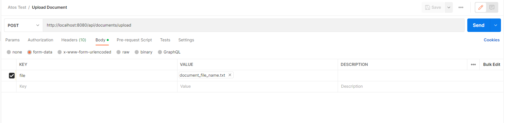

# atos-test - Test API

# Atos Test - Mateus Felipe Miquelão Lopes da Silva

### Technologies
* Java 8
* Maven
* Jersey (JAX-RS) 2.31
* Jetty 9.4.28
* Junit 4.12

### How do I compile?
Run the command below on the repository's root folder.

    $ mvn clean install

### How do I run the Application?
Run the command below on the repository's root folder.

    $ java -jar .\target\atos-test-app.jar

The project will be accessible at the address (Basic path): http://localhost:8080

### Run automated tests (unit test)
Run the command below on the repository's root folder.

    $ mvn test

### Postman collection
The postman collection will be available on the repository's root folder.

Atos Test.postman_collection.json

### Endpoints
- Create Profile
  POST
  URL: http://localhost:8080/api/profiles
  Request Body Sample:
  {
      "username": "angelina_lawrence",
      "name": "Angelina Lawrence",
      "age": 18,
      "email": "angelaw@gmail.com"
  }

- Upload Document
  POST
  URL: http://localhost:8080/api/documents/upload
  Request Headers:
  -> username (username of the previously create profile)
  -> document-name (preferred document name)
  Request Body:
  -> form-data (can be tested on Postman - see https://www.youtube.com/watch?v=S7bwkys6D0E for more details - 
     please use the first option (form-data as a File and specify the key as "file"))

  

- Retrieve Document
  GET
  URL: http://localhost:8080/api/documents/retrieve
  Request Headers:
  -> username (username of the previously create profile)
  -> document-name (document name)

- Delete Document
  DELETE
  URL: http://localhost:8080/api/documents/delete/{documentName}
  Request Headers:
  -> username (username of the previously create profile)
  Path Param:
  -> documentName (document name)
 
